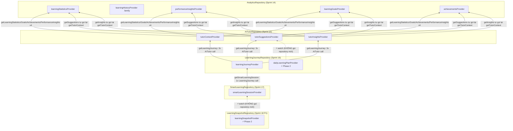

# Provider read flow — Analytics → AI Tutor → Learning Journey → Smart Learning → Read Model

Viết ở Sprint 18 Phase 2 ("Read Model Performance & Provider
Optimization"). Đây là tài liệu ĐẦU TIÊN trong `docs/knowledge/` (xem
`CLAUDE.md` — thư mục này chỉ tạo khi có thứ THẬT cần ghi lại, không
tạo trước). Nếu tài liệu này lệch với code, code thắng — cập nhật lại
tài liệu, đừng tin nó mù quáng.

## 1. Bối cảnh

5 tầng Repository (Sprint 14→18 Phase 1), mỗi tầng CHỈ ghép tầng ngay
dưới, kiến trúc đã đóng băng, KHÔNG đổi ở phase này:

```
AnalyticsRepository (Sprint 14)
        ▲
AITutorRepository (Sprint 15)          — ghép DUY NHẤT AnalyticsRepository
        ▲
LearningJourneyRepository (Sprint 16)  — ghép DUY NHẤT AITutorRepository
        ▲
SmartLearningRepository (Sprint 17)    — ghép DUY NHẤT LearningJourneyRepository
        ▲
LearningSnapshotRepository (Sprint 18 P1) — ghép DUY NHẤT SmartLearningRepository
```

Mỗi Repository là Dart thuần, KHÔNG phụ thuộc Riverpod (gọi được từ
bất kỳ ngữ cảnh nào — mục tiêu đã công bố từ Sprint 15 Phase 1, để 1
AI Tutor thật trong tương lai gọi trực tiếp không cần widget tree).
Provider (`*_providers.dart`) là lớp NGOÀI, bọc Repository bằng
`Provider`/`FutureProvider.autoDispose` — đây là lớp DUY NHẤT được
phép đổi ở phase này.

## 2. Sơ đồ provider hiện có (sau Phase 2)



Mũi tên liền = lệnh gọi Repository THẬT (luôn kích hoạt 1 lượt tính
toán mới xuống tận Analytics/DB). Mũi tên đứt + ⚡ = provider Phase 2
tái dùng OUTPUT của 1 provider khác ĐÃ watch, không tự kích hoạt gì
mới.

## 3. Duplicated-read: đã tìm thấy gì (Task 1)

| Nơi | Lệnh gọi lặp | Nguồn |
|---|---|---|
| `AITutorRepositoryImpl.getSuggestions()`/`getInsights()` | Mỗi hàm tự gọi lại `getTutorContext()` riêng (KHÔNG dùng lại context đã có, nếu có) → 1 lượt mount TutorHomeScreen (watch cả 3 provider AI Tutor cùng lúc) tốn **3× getTutorContext() = 12 lượt AnalyticsRepository**, thay vì 4 nếu chia sẻ | `ai_tutor_repository_impl.dart` (frozen, Sprint 15) |
| `LearningJourneyRepositoryImpl.getLearningJourney()` | Gọi `_aiTutor.getTutorContext()` + `.getSuggestions()` + `.getInsights()` — 3 lệnh AITutor riêng biệt, mỗi lệnh lại tự nhân 4 Analytics ở trên → **tối đa 12 lượt AnalyticsRepository cho 1 lần `getLearningJourney()`** | `learning_journey_repository_impl.dart` (frozen, Sprint 16) |
| `dailyLearningPlanProvider` (trước Phase 2) | Luôn gọi `learningJourneyRepositoryProvider.getDailyPlan()` mới, dù `tutorSuggestionsProvider` có thể đã resolve sẵn (vd TutorHomeScreen đang mounted bên dưới, go_router giữ màn hình cũ khi push) | `learning_journey_providers.dart` (Provider layer — ĐÃ SỬA) |
| `learningSnapshotProvider` (trước Phase 2) | Luôn gọi `learningSnapshotRepositoryProvider.getSnapshot()` mới → kéo theo TOÀN BỘ chuỗi SmartLearning→LearningJourney→AITutor→Analytics, dù `smartLearningSessionProvider` có thể đã resolve sẵn | `learning_snapshot_providers.dart` (Provider layer — ĐÃ SỬA) |

Duplication 2 dòng đầu nằm TRONG Repository (frozen) — không được
sửa ở phase này ("Do NOT redesign"). Duplication 2 dòng cuối nằm ở
Provider layer — CHÍNH nơi Task 2/3 yêu cầu tối ưu.

## 4. Đã tối ưu (Task 2 + 3)

**Quy tắc an toàn áp dụng cho MỌI thay đổi ở phase này** — 1 Provider
A CHỈ được đổi sang `ref.watch(providerB.future)` thay vì tự gọi
Repository của A, nếu **cả hai** đúng:

1. **Substitutability**: `providerB` phải là 1 pass-through TRUNG
   THỰC, KHÔNG đổi, của đúng 1 phương thức Repository interface (không
   phải 1 "đường tắt" dựng lại kết quả bằng hàm thuần bên dưới interface
   — nếu ai đó override Repository bằng 1 implementation khác hẳn hàm
   thuần chuẩn, đường tắt kiểu đó sẽ ÂM THẦM SAI). Đã kiểm chứng bằng
   test hiện có (`learning_journey_providers_test.dart` override
   `aiTutorRepositoryProvider` bằng 1 fake tuỳ ý — nếu
   `tutorSuggestionsProvider` bị đổi thành "tính lại từ
   `tutorContextProvider` bằng `computeTutorSuggestions`" thay vì gọi
   thẳng `.getSuggestions()`, test đó sẽ SAI vì bỏ qua fake. Vì vậy
   `tutorContextProvider`/`tutorSuggestionsProvider`/`tutorInsightsProvider`
   **giữ nguyên KHÔNG đổi** — chúng vẫn là pass-through trung thực, và
   CHÍNH vì vậy an toàn để các provider TẦNG TRÊN tái dùng).
2. **Refresh correctness**: provider A KHÔNG được là mục tiêu
   `ref.invalidate(...)` trực tiếp của bất kỳ màn hình nào (hoặc nếu
   là, màn hình đó phải invalidate luôn providerB cùng lúc). Nếu vi
   phạm, "kéo để làm mới" sẽ âm thầm trả dữ liệu cũ.

Áp dụng quy tắc trên:

- **`dailyLearningPlanProvider`** (`learning_journey_providers.dart`) —
  đổi sang `ref.watch(tutorSuggestionsProvider.future)` +
  `computeDailyLearningPlan` (ĐÚNG hàm thuần
  `LearningJourneyRepositoryImpl.getDailyPlan()` đã dùng). An toàn: (1)
  `tutorSuggestionsProvider` không đổi = pass-through trung thực; (2)
  chưa có UI nào watch/refresh `dailyLearningPlanProvider`.
- **`learningSnapshotProvider`** (`learning_snapshot_providers.dart`) —
  đổi sang `ref.watch(smartLearningSessionProvider.future)` +
  `computeLearningSnapshot` (ĐÚNG hàm thuần
  `LearningSnapshotRepositoryImpl.getSnapshot()` đã dùng). Đây là điểm
  tiết kiệm LỚN NHẤT — tránh cả chuỗi 4 tầng phía dưới nếu
  `smartLearningSessionProvider` đã sống sẵn. An toàn: (1)
  `smartLearningSessionProvider` không đổi; (2) Read Model chưa có màn
  hình nào (chưa có gì để "kéo làm mới" bị sai).

Cả hai đều dùng ĐÚNG hàm thuần Repository frozen đã dùng nội bộ — 0
logic mới, 0 lệnh gọi Repository interface nào bị bỏ qua, chỉ TÁI
DÙNG kết quả nếu đã có sẵn. "Cache" duy nhất ở đây là cơ chế
`FutureProvider.autoDispose` CÓ SẴN của Riverpod (tự quản lý theo scope
watcher còn sống, tự dispose khi không ai watch nữa) — KHÔNG có biến
toàn cục/singleton mutable nào được thêm, đúng yêu cầu "Do not
introduce global mutable caches".

Đã kiểm chứng bằng test đếm số lần gọi Repository thật (xem
`test/learning_journey_providers_test.dart` và
`test/learning_snapshot_providers_test.dart`, mục "Sprint 18 Phase 2"):
watch provider tầng dưới trước (mô phỏng màn hình khác đang mounted),
rồi đọc provider tầng trên — số lần gọi Repository KHÔNG tăng thêm.

## 5. KHÔNG tối ưu — vì sao (Task 3's "only if it preserves correctness")

- **`tutorSuggestionsProvider`/`tutorInsightsProvider`** — về lý
  thuyết CÓ THỂ đổi thành `computeTutorSuggestions`/
  `computeTutorInsights` chạy trên `tutorContextProvider` đã watch, để
  tránh mỗi hàm tự gọi lại `getTutorContext()`. KHÔNG làm — vi phạm
  quy tắc (1) ở trên: đây là 1 "đường tắt" bỏ qua thẳng
  `AITutorRepository.getSuggestions()`/`.getInsights()` (không phải chỉ
  tái dùng KẾT QUẢ của lệnh gọi đó), phá vỡ khả năng thay thế
  Repository bằng 1 implementation khác (vd 1 AI Tutor thật dùng LLM
  sau này, logic gợi ý có thể KHÁC hẳn `computeTutorSuggestions`).
  Duplication 12→4 lượt Analytics này nằm TRONG Repository frozen —
  chấp nhận backlog, không sửa ở phase này.
- **`learningJourneyProvider`** — về lý thuyết CÓ THỂ dựng lại từ 3
  provider AI Tutor đã watch (an toàn theo quy tắc 1, đã kiểm chứng).
  KHÔNG làm — vi phạm quy tắc (2): `learning_journey_screen.dart`'s
  `onRefresh`/`onRetry` CHỈ `ref.invalidate(learningJourneyProvider)`,
  không invalidate 3 provider AI Tutor bên dưới. Sửa đúng cách cần sửa
  luôn màn hình đó (invalidate cascade) — ngoài phạm vi "No UI
  redesign" của phase này.
- **`smartLearningSessionProvider`** — cùng lý do (2):
  `smart_learning_screen.dart` invalidate thẳng provider này, không
  invalidate `learningJourneyProvider` bên dưới.

## 6. Backlog còn lại

- Duplication nội bộ Repository (`getTutorContext()` gọi lặp trong
  `getSuggestions()`/`getInsights()`; `getLearningJourney()` gọi 3 lệnh
  AITutor riêng) — chỉ sửa được nếu redesign Repository, ngoài phạm vi
  MỌI phase tới giờ.
- Nếu 1 phase tương lai ĐƯỢC PHÉP sửa UI, có thể mở khoá tối ưu cho
  `learningJourneyProvider`/`smartLearningSessionProvider` bằng cách
  sửa `onRefresh`/`onRetry` của 2 màn hình liên quan để invalidate
  cascade xuống đúng provider tầng dưới.
- Read Model (`learningSnapshotProvider`) chưa có UI — khi có, màn
  hình đó PHẢI invalidate `smartLearningSessionProvider` (không chỉ
  `learningSnapshotProvider`) nếu muốn nút "làm mới" hoạt động đúng,
  theo đúng quy tắc (2) ở trên.
