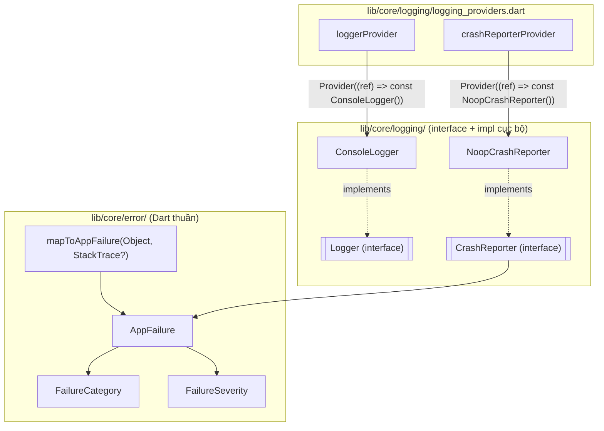

# Reliability architecture — error model & logging foundation

Viết ở Sprint 19 Phase 1 ("Reliability & Production Foundation"),
cập nhật ở Sprint 19 Phase 2 ("Reliability Adoption" — mục 8). Nếu
tài liệu này lệch với code, code thắng.

## 1. Mục tiêu phase này

Dựng HẠ TẦNG (error model + logging interfaces + DI), KHÔNG nối dây
vào bất kỳ Repository/Provider/UI nào đang chạy. Đúng kỷ luật đã lặp
lại xuyên suốt dự án (vd AITutorRepository ở Sprint 15 Phase 1 — xây
xong, "No UI yet", nối dây ở phase sau) — "adopt" là việc của 1 phase
tương lai được giao rõ ràng, không tự ý làm ở đây ("No business logic
changes", "No write path").

## 2. Sơ đồ



`AppFailure`/`FailureCategory`/`FailureSeverity`/`mapToAppFailure` là
Dart thuần — không import Flutter/Riverpod, gọi được từ bất kỳ ngữ
cảnh nào (cùng nguyên tắc "Riverpod-independent" đã áp dụng cho mọi
Repository trong dự án). `Logger` là interface độc lập, không phụ
thuộc `AppFailure`. `CrashReporter` phụ thuộc `AppFailure` (nhiệm vụ
của nó chính là báo cáo AppFailure).

## 3. Task 1 — AppFailure / FailureCategory / FailureSeverity

- `FailureCategory`: đúng 4 giá trị Task 2 liệt kê —
  `database`/`parsing`/`storage`/`unexpected`. Không thêm `network` ở
  phase này ("No networking").
- `FailureSeverity`: `info`/`warning`/`error`/`critical` — TÁC ĐỘNG
  nghiệp vụ, cố ý KHÔNG dùng chung enum với mức log của `Logger` (log
  debug không phải 1 lỗi).
- `AppFailure`: `category` + `severity` + `message` (chuỗi CHẨN ĐOÁN
  cho log, KHÔNG phải chuỗi hiển thị người dùng — cùng kỷ luật "domain
  locale-purity" toàn dự án: 1 tầng trình bày tương lai tự ánh xạ
  `category` sang l10n, giống `TutorSuggestionKind` →
  `tutor_presentation.dart`) + `cause`/`stackTrace` tuỳ chọn (giữ
  nguyên lỗi gốc, không mất ngữ cảnh khi chuẩn hoá).

## 4. Task 2 — error-mapping layer

`mapToAppFailure(Object error, [StackTrace? stackTrace])` — hàm THUẦN
DUY NHẤT, nhận 1 lỗi ĐÃ bắt (không tự catch), phân loại theo TYPE:

| Loại exception | FailureCategory | Ghi chú |
|---|---|---|
| `DriftWrappedException`, `InvalidDataException` (`package:drift`) | `database` | Drift đã là dependency có sẵn — không thêm package nào |
| `FormatException` (`dart:core`) | `parsing` | |
| `FileSystemException` (`dart:io`) | `storage` | Cùng loại lỗi `IoCacheManager` gặp phải |
| Mọi thứ khác | `unexpected` (severity `critical`) | Luôn có 1 nhóm hứng được, không bao giờ "không phân loại" |

Idempotent: nếu `error` đã là `AppFailure`, trả về nguyên vẹn (không
bọc lồng nhau).

## 5. Task 3 — logging interfaces

- `Logger` (`debug`/`info`/`warning`/`error`) — interface thuần.
- `CrashReporter` (`recordFailure(AppFailure)`/`log(String)`) —
  interface thuần.
- **Quyết định có chủ đích**: mỗi interface có ĐÚNG 1 implementation
  CỤC BỘ (không-cloud) đi kèm — `ConsoleLogger` (dùng
  `dart:developer.log`, có sẵn trong SDK, đúng lý do lint `avoid_print`
  tồn tại — "dùng logger, không dùng print") và `NoopCrashReporter`
  (không làm gì). Đọc "Interfaces only. No concrete cloud
  implementation" là: KHÔNG thêm SDK cloud nào (Crashlytics/Sentry...),
  KHÔNG phải "không được có bất kỳ implementation nào" — nếu không có
  implementation nào cả, Task 4 (Provider) và mục Testing ("Provider
  tests") của chính phase này không thể thực hiện được (`Provider<T>`
  cần dựng 1 giá trị `T` thật). `ConsoleLogger`/`NoopCrashReporter` mở
  đường cho `loggerProvider`/`crashReporterProvider` hoạt động đúng
  ngay hôm nay mà không vi phạm "No cloud SDK".

## 6. Task 4 — DI providers

`lib/core/logging/logging_providers.dart`:

```dart
final loggerProvider = Provider<Logger>((ref) => const ConsoleLogger());
final crashReporterProvider = Provider<CrashReporter>((ref) => const NoopCrashReporter());
```

Cùng hình dạng `appDatabaseProvider`
(`core/database/database_providers.dart`) — dựng thẳng implementation
mặc định, KHÔNG cần override bắt buộc ở `main.dart` (khác
`sharedPreferencesProvider`, vốn cần 1 instance plugin nền tảng khởi
tạo bất đồng bộ TRƯỚC `runApp`). Khi có implementation cloud thật ở
sprint sau, chỉ cần `overrideWithValue(...)` ở `main.dart` — mọi nơi
gọi phụ thuộc đúng interface `Logger`/`CrashReporter`, không phụ thuộc
`ConsoleLogger`/`NoopCrashReporter` trực tiếp, nên không cần sửa gì
thêm.

## 8. Sprint 19 Phase 2 — Reliability Adoption

Nối hạ tầng Phase 1 vào 9 Repository "nhóm nền" — những Repository
đọc/ghi Drift TRỰC TIẾP (Group A `AppDatabase`: `QuranRepositoryImpl`,
`LexiconRepositoryImpl`; Group B `UserDatabase`:
`UserContentRepositoryImpl`, `StudySessionRepositoryImpl`,
`KhatmCycleRepositoryImpl`, `BookmarkCollectionRepositoryImpl`,
`QuizRepositoryImpl`, `FlashcardRepositoryImpl`,
`SchedulerRepositoryImpl`). KHÔNG động tới 5 Repository orchestration
thuần (`AnalyticsRepository` → `LearningSnapshotRepository`, Sprint
14-18) — chúng không tự đọc/ghi gì, mọi lỗi của chúng đã bắt nguồn (và
đã được log) ở 1 trong 9 Repository nền này; bọc thêm ở đó chỉ tạo log
trùng lặp cho CÙNG 1 lỗi gốc, không phải "meaningful event" mới.

### Cơ chế dùng chung — `lib/core/logging/repository_boundary_logging.dart`

```dart
Future<T> withFailureLogging<T>(Logger logger, String operation, Future<T> Function() body);
Stream<T> withFailureLoggingStream<T>(Logger logger, String operation, Stream<T> source);
```

Viết ĐÚNG 1 lần, dùng lại ở cả 9 Repository — mọi phương thức công
khai của mỗi Repository giờ có dạng:

```dart
@override
Future<Foo> getFoo() {
  return withFailureLogging(_logger, 'getFoo', () async {
    ... thân hàm CŨ, KHÔNG đổi 1 dòng logic nào ...
  });
}
```

Cả hai hàm CHỈ làm 2 việc khi có lỗi: (1) `mapToAppFailure()` rồi
`logger.error(...)` — TÁC DỤNG PHỤ duy nhất; (2) `rethrow`/`throw error`
lỗi GỐC (không phải AppFailure đã map) — đảm bảo type, identity,
stackTrace y hệt trước khi có wrapper, nên bất kỳ nơi gọi nào (test,
`AsyncValue.error` ở UI...) nhận được đúng lỗi như cũ. Khi THÀNH CÔNG,
không log gì — đúng "Do NOT log normal execution".

### Task 3 — Dependency injection

Constructor của cả 9 `*RepositoryImpl` nhận thêm `Logger` (tham số vị
trí BẮT BUỘC, ngay sau các dependency đã có — vd
`SchedulerRepositoryImpl(db, algorithm, logger, {...})`, thứ tự khớp
`SchedulingAlgorithm` đã có sẵn ở đó từ trước). Mọi
`*_providers.dart` tương ứng truyền `ref.watch(loggerProvider)` vào —
KHÔNG file `*_repository_impl.dart` nào tự `import
'.../console_logger.dart'`/dựng `ConsoleLogger()` (đã kiểm tra lại
toàn bộ 9 file, đúng yêu cầu "Never instantiate ConsoleLogger
directly"). Test dựng Repository trực tiếp (không qua Provider) truyền
`const ConsoleLogger()` tại chỗ gọi — hợp lệ, vì ràng buộc chỉ áp dụng
cho REPOSITORY, không áp dụng cho test setup.

### Task 4 — Hành vi giữ nguyên

Vì `rethrow` nguyên lỗi gốc, MỌI test hiện có (call site cũ, vd
`test/quran_repository_test.dart`) chỉ cần thêm đúng 1 tham số
`Logger` vào constructor call — không cần sửa assertion nào khác, vì
kết quả trả về/lỗi ném ra không đổi. Đã kiểm chứng qua `flutter
analyze --fatal-infos` sạch + toàn bộ test cũ vẫn xanh (xem Return
report Phase 2 mục "Test results").

### Trường hợp log trùng lặp (đã chấp nhận, có chủ đích)

Vài phương thức công khai gọi LẪN NHAU trong cùng 1 Repository (vd
`StudySessionRepositoryImpl.currentStreak()` gọi
`distinctReadingDates()`; `LexiconRepositoryImpl.getRelatedLemmas()`
gọi `getLemmasByIds()`; `QuranRepositoryImpl.searchAyahs()`/`getAyahsByIds()`
cùng gọi `_headersForIds()` — riêng hàm private này KHÔNG bọc riêng,
chỉ 2 hàm public gọi nó có bọc). Nếu lỗi xảy ra ở tầng SÂU NHẤT, nó có
thể bị log 2 LẦN (1 lần ở hàm bị gọi, 1 lần ở hàm gọi nó) — CHẤP NHẬN
đánh đổi này: tránh phải tách thêm hàm private chỉ để né trùng log
(sẽ là 1 thay đổi cấu trúc lớn hơn mức cần thiết cho phase này), và
log trùng vẫn AN TOÀN hơn thiếu log.

## 9. Chưa làm (backlog, ngoài phạm vi phase này)

- 5 Repository orchestration thuần (`AnalyticsRepository` →
  `LearningSnapshotRepository`) vẫn CHƯA có logging riêng — cố ý, xem
  lý do ở mục 8. Nếu 1 phase tương lai muốn log RIÊNG ở tầng đó (vd để
  phân biệt "lỗi trong Analytics" khỏi "lỗi trong AITutor"), cần cân
  nhắc lại đánh đổi trùng log ở trên.
- Implementation cloud thật (Crashlytics/Sentry...) cho `CrashReporter`
  — cần duyệt thêm 1 package mới, ngoài phạm vi "No cloud SDK" của
  phase này.
- `FailureCategory` chưa có `network` — thêm khi tính năng mạng/đồng
  bộ (Supabase, xem `ARCHITECTURE.md`) thật sự cần.
