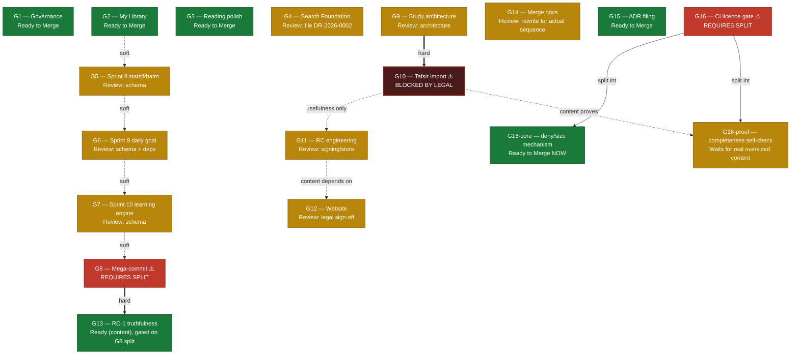

# Release Dependency Graph

Companion to [`RELEASE_RECOVERY_PLAN.md`](RELEASE_RECOVERY_PLAN.md) and
[`RELEASE_INVENTORY.md`](RELEASE_INVENTORY.md). Analysis only — no
repository state was changed in producing this.

## Graph

## Independence classes

### Fully independent — can move today, in any order, in parallel
**G1, G2, G3, G4, G15, and G16-core (once split out).** None of these
share a file, a schema, or a legal question with anything else in the
inventory. This is the entire content of Phase 1.

### Chained but self-contained — can move today, in sequence, isolated from the legal question
**G5 → G6 → G7** (soft dependency: shared stats/learning domain, best
reviewed as one pass rather than three, per `RELEASE_RECOVERY_PLAN.md`
Part 1) → **G8 (after split) → G13 (hard dependency, must accompany)**.
This entire chain never touches `assets/database/quran.sqlite` or the
tafsir corpus — it can complete in full without G10 ever resolving.

### Gated on G8's split specifically, not on G10
**G13** cannot merge before or without G8. This is a **hard** edge —
merging G8 without G13 ships the pre-RC-1 mislabeled AI Tutor surface,
which is worse than merging neither.

### Gated on G9, not on G10 directly
**G10** has a hard architectural dependency on G9 (the tafsir-as-
content-source model must exist before the import that uses it makes
sense) — but G9 itself has **no dependency on G10** and can merge
independently. G9 is Phase 2 work; it does not inherit G10's legal
block.

### Gated on G10 by usefulness, not by code
**G11** (release mechanics) and, transitively, **G12** (website/store
content) can be *reviewed* without G10, but merging them ahead of G10
ships signing/store readiness for content that can't ship yet. This is
a scheduling dependency, not a technical one — captured in the graph as
a dotted "usefulness only" edge, distinct from G8→G13's hard edge.

### Split internally: half free, half chained
**G16** is the one group whose two halves belong in different
independence classes. `G16-core` (the deny-pattern and size-threshold
mechanism) has no dependency on G10 and should move in Phase 1.
`G16-proof` (the one self-verifying test that needs an actual oversized
tracked file to test itself against) has a real content dependency and
stays in Phase 4's neighborhood until G10 resolves, or until it's
rewritten to report "not yet applicable" instead of hard-failing — see
`RELEASE_RECOVERY_PLAN.md` Part 3 for the exact test and reasoning.

### The one true sink
**G10** is the only node with no outgoing "unblocks nothing until I'm
done" — everything that depends on it (G11, G12 by usefulness, and
`G16-proof` by content) can wait indefinitely without blocking anything
else in the graph. Nothing in Phases 1–3 requires G10 to move first.

## Reading the graph for scheduling

- **Solid/hard arrows** (`==>`) mean: never merge the target without
  the source already merged (G8→G13), or never merge the target at all
  while the source is unresolved (G9→G10, since G10 needs G9's
  architecture to exist).
- **Dotted arrows** (`-.->`) mean: merging the target without the
  source is technically possible but pointless or premature — a
  scheduling preference, not a hard gate.
- **Every node reachable without passing through G10** is exactly
  Phase 1 + Phase 2 + Phase 3 of the roadmap — which is 15 of 16
  groups. G10 sits off to the side of almost the entire graph, not at
  its center — the inventory's size made it easy to assume otherwise.
